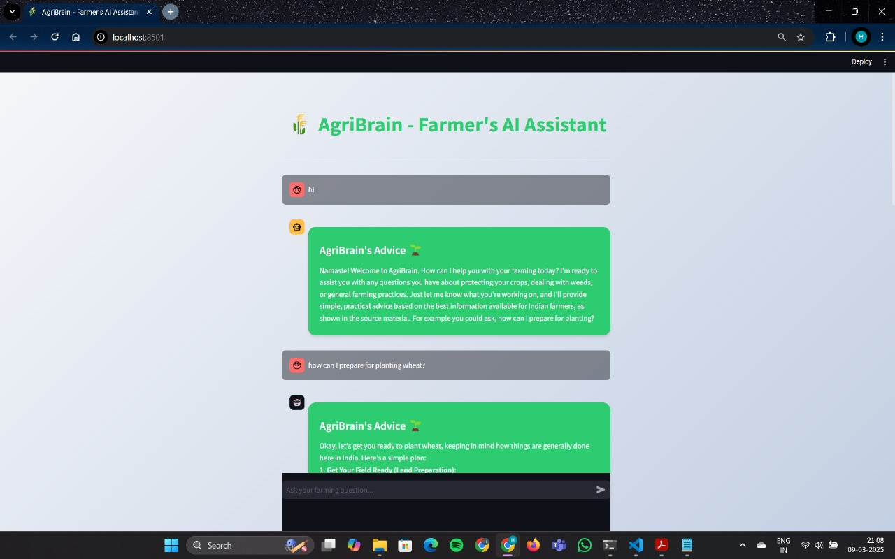
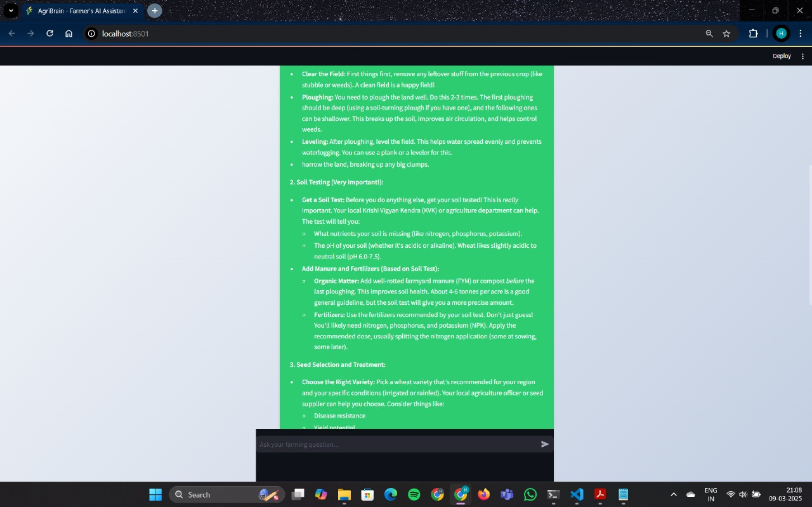
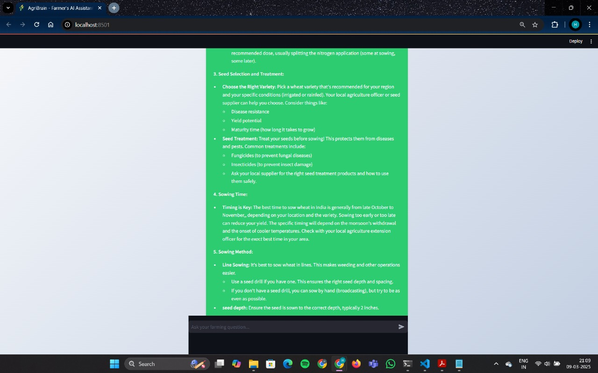
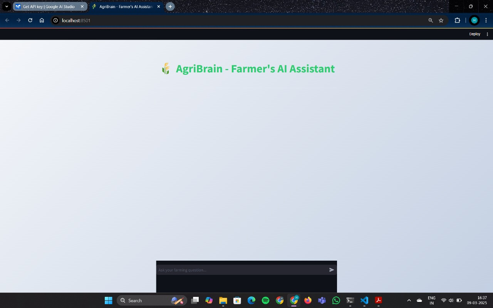

---

# 🌾 **AgriBrain**

*AI-powered chatbot for smart farming using Google’s Gemini API & RAG architecture*

---

## ⚙️ **Environment Setup**

### 1️⃣ Create `.env` File

This file is not tracked in Git (for security). To create it:

```bash
cp .env.example .env
```

### 2️⃣ Add Your API Key

Edit `.env` and add your Google API key:

```bash
GOOGLE_API_KEY=your_google_api_key_here
```

---

## 🚀 **Running the Application**

1. Navigate to the project directory:

   ```bash
   cd agribrain
   ```

2. Create and activate virtual environment:

   ```bash
   python -m venv venv
   venv\Scripts\activate  # On Windows
   # OR
   source venv/bin/activate  # On macOS/Linux
   ```

3. Install dependencies:

   ```bash
   pip install -r requirements.txt
   ```

4. Launch the app:

   ```bash
   streamlit run frontend.py
   ```

---

## 🖼️ **Screenshots**

* 
* 
* 
* 

---

